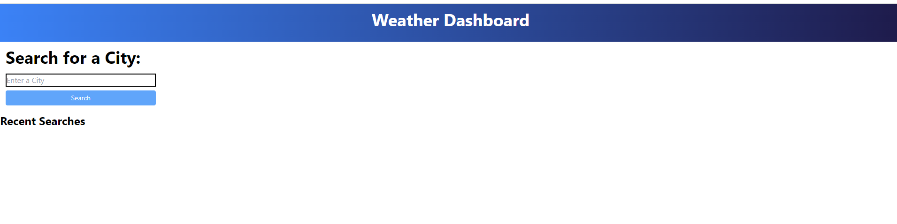
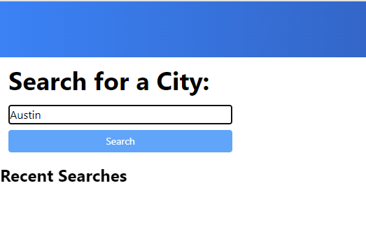
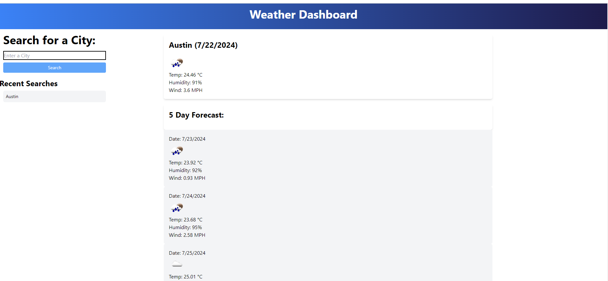
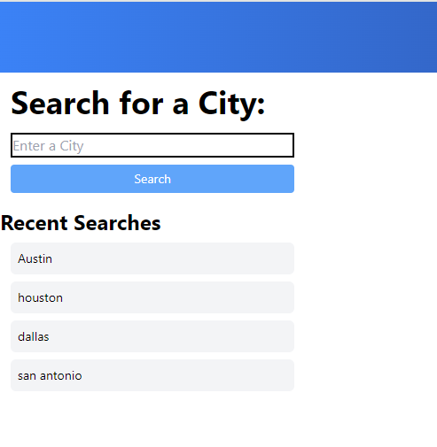

# Weather Dashboard

## Table of Contents
- [Introduction](#introduction)
- [Features](#features)
- [Technologies Used](#technologies-used)
- [Setup and Installation](#setup-and-installation)
- [Usage](#usage)
- [File Structure](#file-structure)
- [Credits](#credits)
- [License](#license)

## Introduction
The Weather Dashboard is a web application that allows users to search for the current weather and a 5-day forecast for any city. It uses the OpenWeatherMap API to fetch weather data and displays it in a user-friendly format.

## Features
- Search for current weather and 5-day forecast by city.
- Display recent searches.

## Technologies Used
- HTML
- CSS (Tailwind CSS)
- JavaScript
- OpenWeatherMap API

## Setup and Installation
1. Clone the repository to your local machine:
    ```bash
    git clone https://github.com/ajgarza27/Module6_WeatherDashboard.git
    ```
2. Navigate to the project directory:
    ```bash
    cd weather-dashboard
    ```
3. Open `index.html` in your web browser.

## Usage
1. Open the application in your web browser.
 
2. Enter a city name in the search input field.

3. Click the "Search" button to fetch and display the current weather and 5-day forecast for the specified city.

4. Recent searches will be displayed below the search input.


## Credits
- Developer: Alanna Johnson-Garza (https://github.com/ajgarza27)
- [OpenWeatherMap](https://openweathermap.org/) for providing the weather data API.
- Tutor via Preply was used

## License
This project is licensed under the MIT License - see the [LICENSE](LICENSE) file for details.
